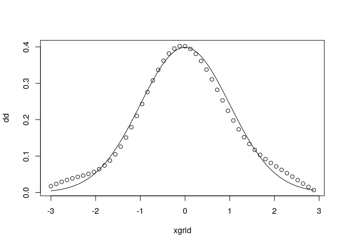

<!-- README.md is generated from README.Rmd. Please edit that file -->

This is some code (it is less than an R package) for estimating a
distribution of a latent variable using Kotlarski’s Lemma; in
particular, implementing the results in Li and Vuong (1998).

The setup is one where one is interested in the distribution of some
latent variable X. One observes two measured with error versions of X;
call these X\_1 and X\_2, and they are given by

<center>

X\_1 = X + e\_1 <br> X\_2 = X + e\_2

</center>

and under the condition that X, e\_1, and e\_2 are mutually independent.
The provided code (two files: `kotlarski.R` and `tuning_parameters.R`)
will estimate the pdf of X in this case.

To get things working, you to follow the following steps

  - Execute the code in `tuning_parameters.R` – you should set the
    values of the tuning parameters to be whatever you want them to be
    (some preliminary values are set there that work in the example
    below, but are not guaranteed to work across applications)
  - Using your data that includes exactly two measurements of the latent
    variable, save these in variables called `X1` and `X2`
  - Once you have completed these two steps, just run
    `cf2dens(kotlarski, tgrid, xgrid)` – `kotlarski` is the name of the
    function that does most of the work here, `tgrid` and `xgrid` are
    set in
`tuning_parameters.R`

<!-- end list -->

``` r
#-----------------------------------------------------------------------------
# Some simulations to check that everything works
#-----------------------------------------------------------------------------
```

``` r
# load the code
source("/path/to/code/kotlarski.R")
source("/path/to/code/tuning_parameters.R")
```

``` r
n <- 5000
X <- rnorm(n)
e1 <- rnorm(n)
e2 <- rnorm(n)
X1 <- X + e1
X2 <- X + e2


# run the code to produce the pdf of x
dd <- cf2dens(kotlarski, tgrid, xgrid)

# plot the estimated pdf
plot(xgrid, dd)

# compare to true pdf
curve(dnorm(x), add=TRUE)        
```

<!-- -->
